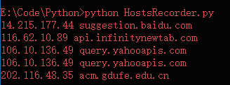

# HostsRecorder

A tool for recording the domain - ip relation for browser.

## Usage
Python 2.x
1. ` python HostsRecorder.py `
1. Set your browser proxy to 127.0.0.1:8080
1. Visit http website (https Not supported), and the result will be output to `./ip_hosts.txt`   

## Usage Case
1. Backup hosts to avoid DNS crashed .
2. Get the ip of a lot of domains instead of ping.

## License
**The MIT License**