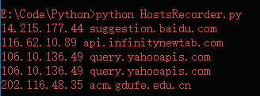

# HostsRecorder
该工具用于记录浏览器所访问的域名，获取对应ip，并生成hosts格式文件。

English Version: [README](./README-en.md)

## 用法
Python 2.x环境，3.x至少需要更改 print 语法
1. ` python HostsRecorder.py `
1. 将浏览器代理设为 127.0.0.1:8080
1. 访问各http网站即可获得下图(不支持https)，结果也会输出到同目录的 `ip_hosts.txt` 

## 使用场景
1. 备份hosts，避免DNS崩了没法上内网，比如公司内网DNS
2. 批量获取域名对应ip（ping的话批量就尴尬）
3. 在异地服务器上使用即可获得当地的DNS解析情况

## License
**The MIT License**